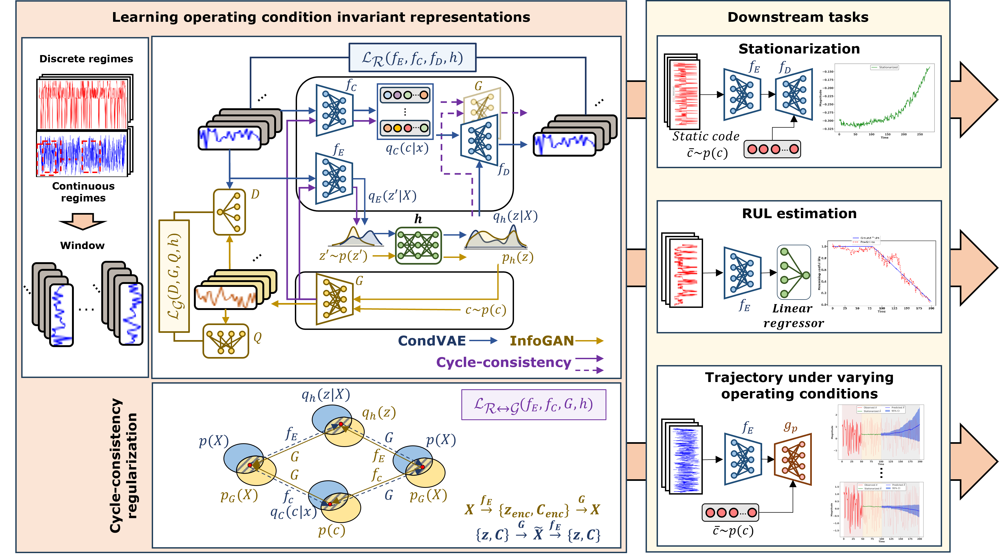

# OCIR: Operation Condition-Invariant Representation Learning for Machine Prognostics

This repository is the official implementation of "Operation Condition-Invariant Representation Learning for Machine Prognostics" for quick demo. The work is currently submitted to a journal and preprint with a link will be available soon.

<!-- [Paper link](link).  -->

A novel framework for learning *Operating Condition-Invariant Representations (OCIR)* is implemented based on *a hybrid InfoGAN–CondVAE architecture*. OCIR learns operating condition-invariant machine health representations directly from raw machine condition monitoring data that are subject to either discrete or continuous operating regimes in *the absence of operational parameters*.



1) **We introduce a novel cycle-consistency regularization** that encourages the mutual improvement between the generative and inference networks in an end-to-end fashion.

2) We show that the learned invariant representations are highly effective in various downstream tasks. Especially, in the key downstream task-remaining useful life estimation, the **OCIR outperforms the custom baseline models and state-of-the-art models that do and do not incorporate the operation parameters by notable margin**.

3. Moreover, we show that OCIR can readily facilitate the transformation of given raw data subject to varying operating conditions into any of the learned operating conditions. Using this, **we showcase a construction of a novel trajectory model in “virtually stationary” operating condition**, directly from raw condition monitoring data under varying operating conditions.


## Getting started
Clone the OCIR repository via git as follows:

```clone
git clone https://github.com/minkiml/OCIR-learning.git
```

Then, install requirements as follows:

```setup
pip install -r requirements.txt
```

The current implementation uses a single GPU and provides no multiple GPU setup. 

## Datasets
1. Download datasets from the [link](https://www.nasa.gov/intelligent-systems-division/) and save it to a directory. 

2. Manually set the path_ variable of line 32 in [cmapssformater.py](datasets/data_format/cmapssformater.py) to the path to the downloaded data in step 1.

3. Running any of experiment scripts will automatrically run the formatting and saving the formatted data in a new data directory ("cmpass_dataset" folder) under "datasets" folder.

## Running experiments
There are 3 different sets of experimental scripts under this [folder](scripts)

### Representation learning
To train OCIR for representation learning, for instance,do 

```trainrl
sh ./scripts/rl/ocir_learning.sh
```

### RUL estimation
To train OCIR for rul estimation, for instance, do 

```trainrul
sh ./scripts/rul/ocir_learning_disc_rul_FD002.sh
```
This automatically trains OCIR on representation learning first (if no pretrained one is available) and applies it to RUL estimation.

### Trajectory construction
To train OCIR for trajectory construction, for instance, do 

```traintrj
sh ./scripts/trj/ocir_learning_disc_trj_FD002.sh
```
This automatically trains OCIR on representation learning first (if no pretrained one is available) and applies it to trajectory reconstruction.
